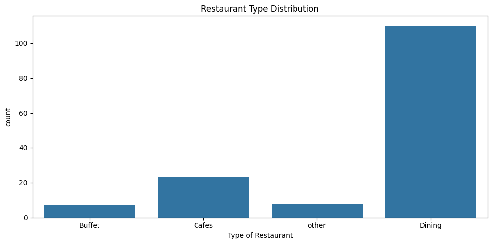
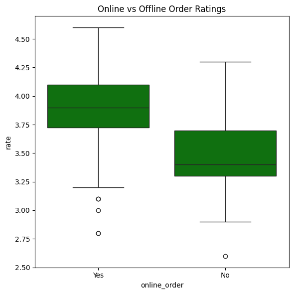
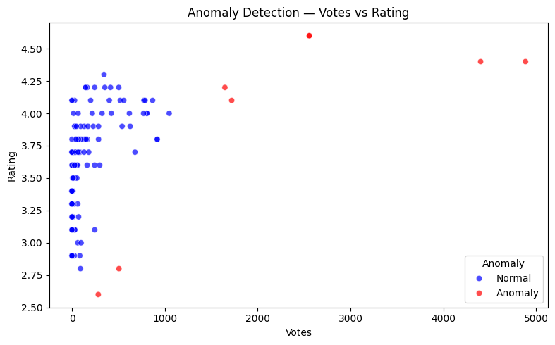
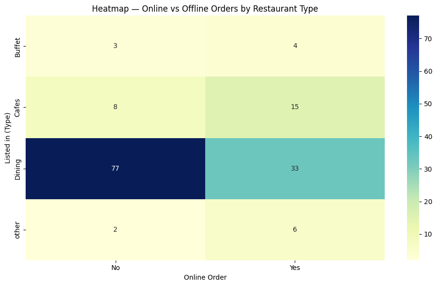

# 🍽️ Zomato Restaurant Data Analysis & Insights

---
📜 Project Description
--- 

An end-to-end **exploratory data analysis (EDA)** and **business intelligence** project on Zomato's restaurant dataset. This project uncovers actionable insights on customer behavior, restaurant performance, ordering trends, and spending patterns — with anomaly detection and statistical hypothesis testing to support data-driven decision-making.
> **Business Goal:** Help Zomato optimize operations, improve customer experience, and identify high-impact opportunities using data.

---
🔍 Problem Statements
---
| # | Business Question |
|---|---|
| 1 | What are the most popular restaurant types based on customer orders? |
| 2 | Which restaurant categories receive the most votes? |
| 3 | What is the rating distribution across restaurants? |
| 4 | What are the spending habits of couples ordering together? |
| 5 | Do online orders receive higher ratings than offline orders? |
| 6 | Which restaurant types get the most offline orders? |
| 7 | Are there anomalies indicating unusual restaurant performance? |
| 8 | Can ordering and performance hypotheses be statistically validated? |

---
🌟 Key Features of the Project
---

🧹 Data Cleaning & Preprocessing

- Converted rate column from string format to numeric for accurate analysis
- Handled missing values and standardized data types across all columns

🔎 Exploratory Data Analysis (EDA)

- Restaurant Type Analysis: Count plot to identify most popular categories
- Vote Distribution: Aggregated total votes by restaurant type
- Rating Analysis: Histogram revealing customer satisfaction trends
- Spending Habits: Distribution of approximate cost for two people

📊 Data Visualizations

- Heatmap for online vs offline ordering preferences by restaurant type
- Scatter plots for votes vs rating relationship
- Bar charts for average cost comparison across categories

🚨 Anomaly Detection

- Scaled numerical features using StandardScaler, then applied Isolation Forest to flag 7 outlier restaurants with disproportionate votes-to-rating ratios

🧪 Hypothesis Testing

- Online vs Offline Ratings: Welch's T-test to compare average ratings across ordering modes
- Dining Votes Comparison: T-test to validate if casual dining receives significantly more votes

---

## 📊 Visualizations
 
### 1. Restaurant Type Distribution

 
### 2. Online vs Offline Order Ratings

 
### 3. Anomaly Detection — Votes vs Rating

 
### 4. Online vs Offline Orders Heatmap


---
 
## 🛠️ Tech Stack
 
| Category | Tools |
|---|---|
| Language | Python |
| Data Manipulation | Pandas, NumPy |
| Visualization | Seaborn, Matplotlib |
| Machine Learning | Scikit-learn (Isolation Forest) |
| Statistical Analysis | SciPy (Welch's T-test) |
| Feature Scaling | StandardScaler |
 
---
 
## 💡 Insights
 
- **Dining restaurants dominate offline orders** — prime target for offline promotional campaigns and loyalty offers
- **Online ordering correlates with higher ratings** — suggests better customer experience and satisfaction in online mode
- **Majority of couples spend ₹200–₹500 per order** — useful benchmark for pricing strategy and combo meal planning
- **7 restaurants flagged as anomalies** — disproportionate votes-to-rating ratios indicate either fake reviews or exceptionally viral outlets
- **Casual Dining receives significantly more votes** — than other restaurant types, statistically validated via Welch's T-test
 
---

## 🚀 How to Run
 
```bash
# Clone the repository
git clone https://github.com/bhushang9/zomato-data-analysis.git
 
# Install dependencies
pip install pandas numpy seaborn matplotlib scikit-learn scipy
 
# Open the notebook
jupyter notebook zomato_data_analysis.ipynb
```
 
---
 
## 📌 Skills Demonstrated
 
`Exploratory Data Analysis` `Data Cleaning` `Data Visualization` `Anomaly Detection` `Hypothesis Testing` `Statistical Analysis` `Business Intelligence` `Python` `Pandas` `Scikit-learn` `SciPy` `Seaborn`
 
---
 
## 👤 Author
 
**Bhushan Gholekar** [LinkedIn](https://linkedin.com/in/bhushan-gholekar09)

---
