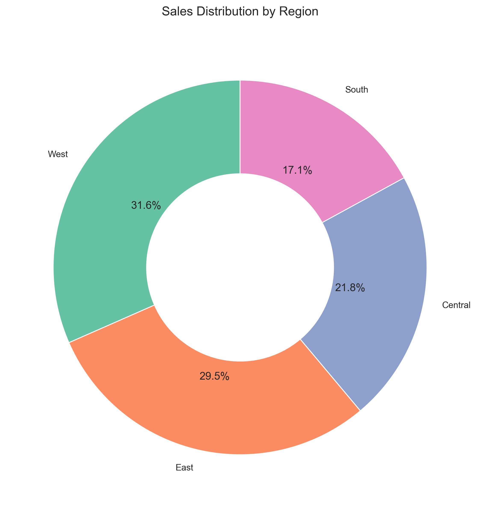
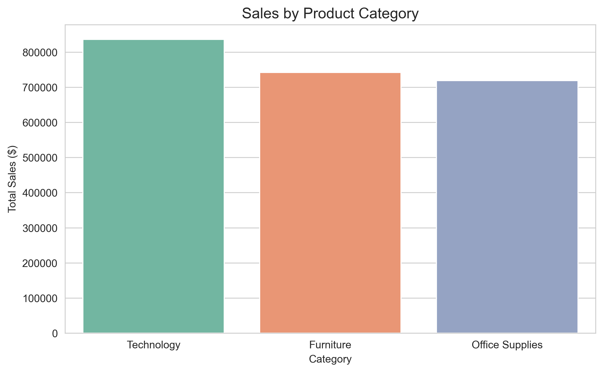
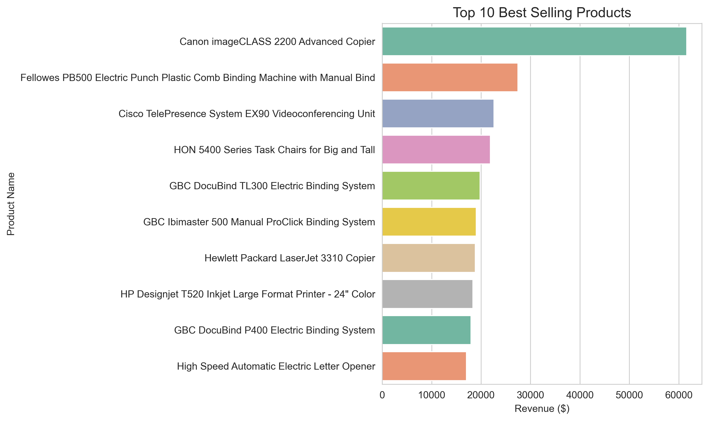
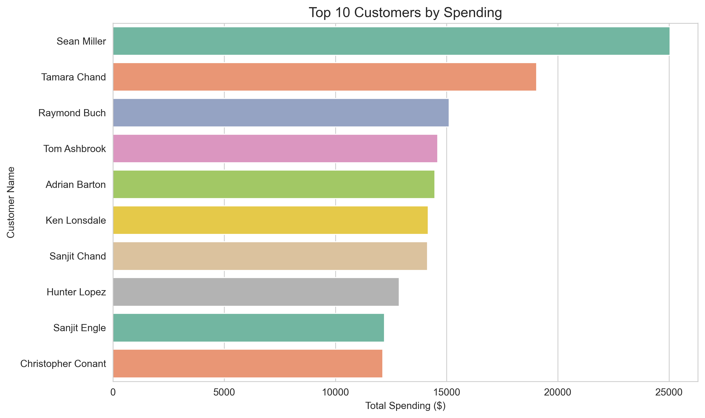
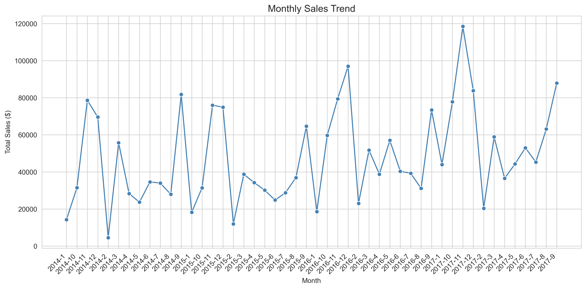
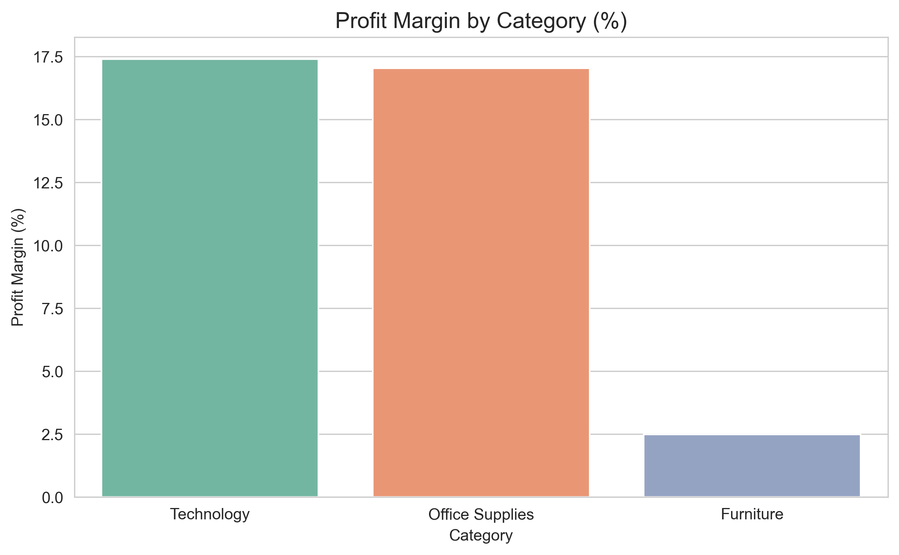
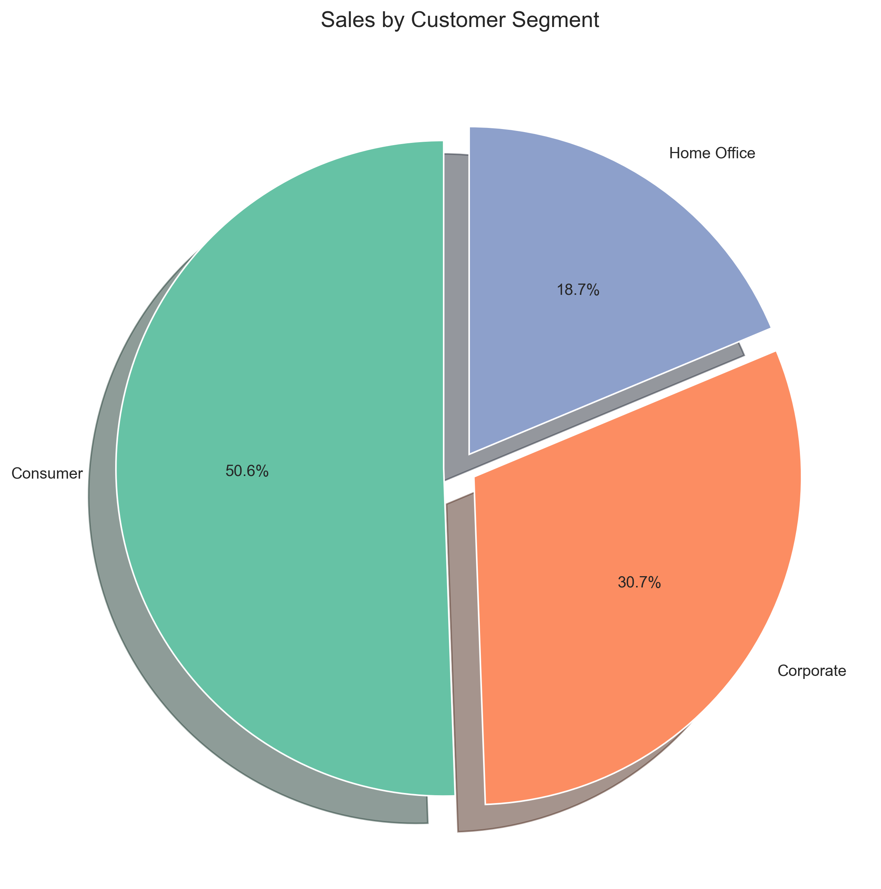
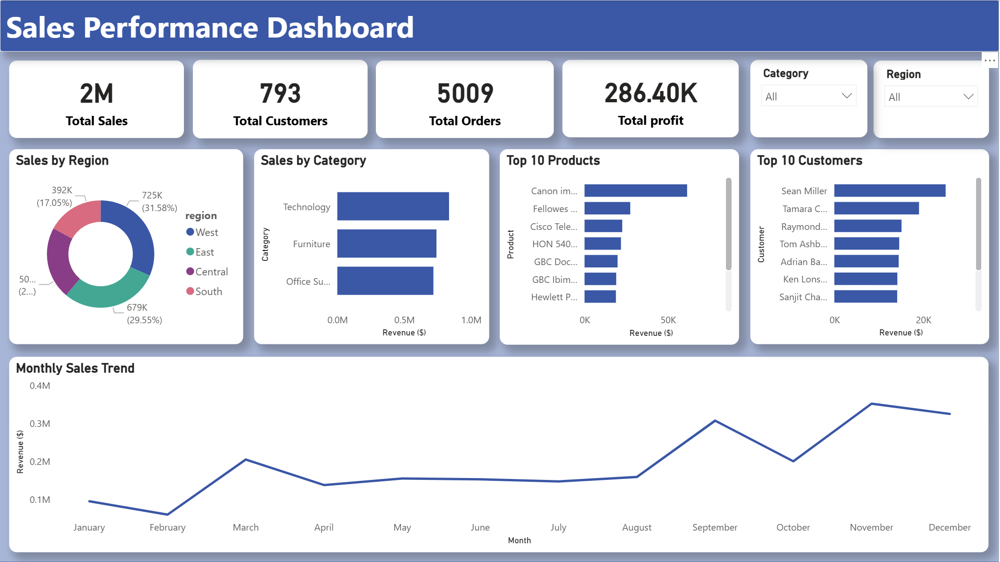

# 🛒 E-Commerce Sales Analytics

     

---

## 📌 Project Overview

A full-stack sales analytics project built on a superstore e-commerce dataset of **9,994 records** and **5,009 unique orders**. The raw data was cleaned in Python, stored in a **SQLite database**, analyzed using **13 SQL business queries**, visualized through **7 charts**, and summarized in an **interactive Power BI dashboard** — covering $2.29M in total revenue across regions, categories, and customer segments.

> **Goal:** Identify key revenue drivers, top-performing products and customers, and sales patterns to support data-driven business decisions.

---

## 🔍 Problem Statements

| # | Business Question |
|---|---|
| 1 | Which regions generate the highest sales and profit? |
| 2 | Which product categories and individual products drive the most revenue? |
| 3 | Who are the top 10 customers by total spending? |
| 4 | How do sales trend month by month across the dataset? |
| 5 | Which customer segments contribute the most to overall revenue? |
| 6 | What is the profit margin across product categories? |

---

## 🌟 Key Features

**🧹 Data Cleaning & Preprocessing**
- Loaded raw dataset of 9,994 records and inspected for nulls and duplicates
- Converted `Order Date` and `Ship Date` to datetime and extracted `order_year` and `order_month` for time-series analysis
- Standardized all column names to lowercase with underscores for SQL compatibility
- Saved cleaned dataset as `cleaned_salesdata.csv`

**🗄️ SQLite Database Integration**
- Loaded cleaned data into a local SQLite database using Python's `sqlite3` library
- All EDA queries executed directly against the database using `pd.read_sql()`
- Separate `business_queries.sql` file contains 13 standalone SQL queries for business reporting

**🔎 SQL Business Queries (13 total)**
- Total orders, unique customers, revenue, and profit summary
- Sales and profit breakdown by region, category, and customer segment
- Top 10 best-selling and most profitable products
- Top 10 customers by total spending
- Monthly sales trend with zero-padded month formatting
- Profit margin percentage calculated per category

**📊 Visualizations (7 total)**
- Donut chart for regional sales share
- Bar charts for category sales and profit margin
- Horizontal bar charts for top 10 products and customers
- Line chart for monthly sales trend
- Pie chart for customer segment distribution

**📈 Interactive Power BI Dashboard**
- KPI cards showing Total Sales ($2.29M), Total Orders (5,009), Total Profit ($286.4K), Total Customers (793)
- Dynamic slicers for filtering by Region and Category
- All key charts reproduced interactively for business stakeholder reporting

---

## 📊 Visualizations

### 1. Sales Distribution by Region


### 2. Sales by Product Category


### 3. Top 10 Best Selling Products


### 4. Top 10 Customers by Spending


### 5. Monthly Sales Trend


### 6. Profit Margin by Category


### 7. Sales by Customer Segment


---

## 📈 Power BI Dashboard




---

## 🛠️ Tech Stack

| Category | Tools |
|---|---|
| Language | Python 3.11 |
| Data Manipulation | Pandas |
| Database | SQLite3 |
| Querying | SQL (13 business queries) |
| Visualization | Seaborn, Matplotlib |
| Dashboard | Power BI |
| Data Source | Kaggle — Superstore Sales Dataset |

---

## 💡 Key Insights

- **West region leads in total sales** — contributing the highest revenue share across all four regions
- **Technology is the top revenue category** — Canon imageCLASS 2200 Advanced Copier is the single best-selling product
- **Total revenue of $2.29M with $286.4K profit** — overall profit margin of ~12.5% across the dataset
- **Sean Miller is the top customer** by total spending — a small group of high-value customers drives a disproportionate share of revenue
- **Monthly sales peak toward year-end** — November and December show the highest sales volumes, indicating strong seasonal demand
- **Office Supplies has the highest profit margin %** despite lower absolute sales — most efficient category by profitability

---

## 🚀 How to Run

```bash
# Clone the repository
git clone https://github.com/bhushang9/ecommerce-sales-analytics.git

# Install dependencies
pip install pandas matplotlib seaborn

# Step 1 — Run data cleaning
jupyter notebook notebooks/data_cleaning.ipynb

# Step 2 — Create SQLite database
python src/create_database.py

# Step 3 — Run EDA
jupyter notebook notebooks/eda.ipynb
```

> Power BI dashboard file is in the `dashboards/` folder. Open with Power BI Desktop.

---

## 👤 Author

**Bhushan Gholekar**
[LinkedIn](https://linkedin.com/in/bhushan-gholekar09) • [GitHub](https://github.com/bhushang9)
