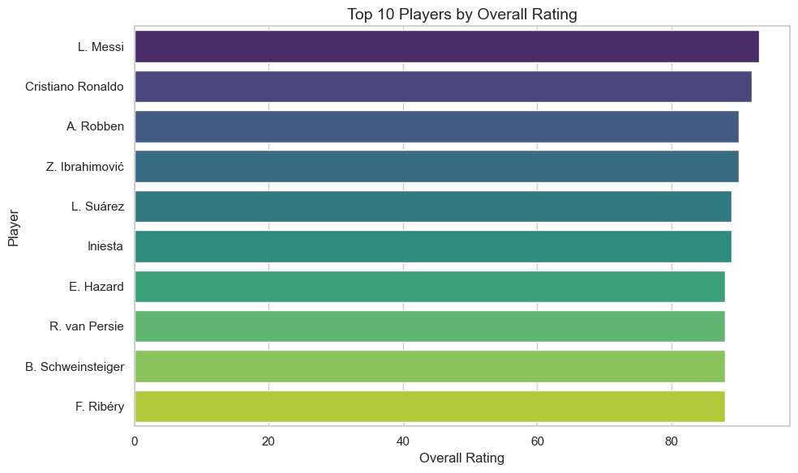
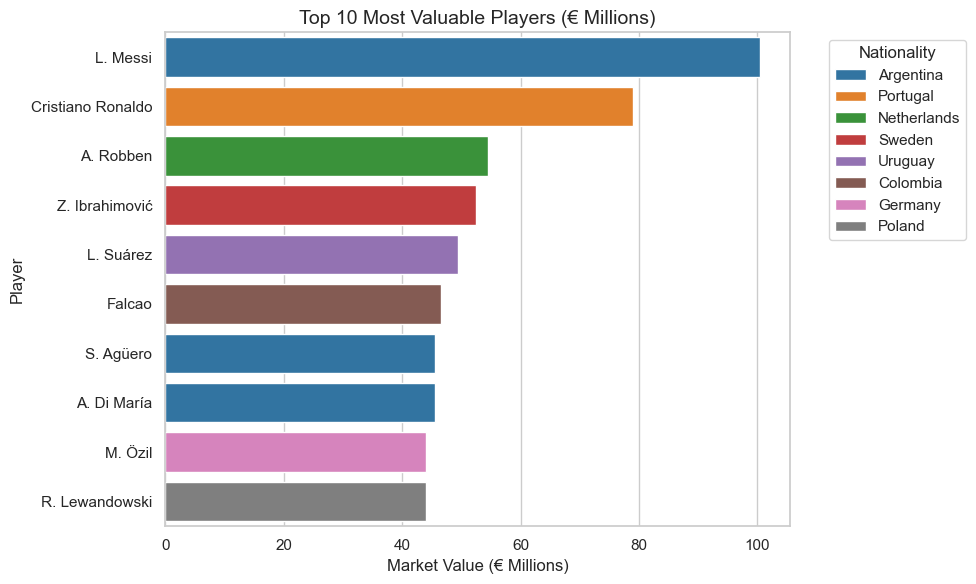
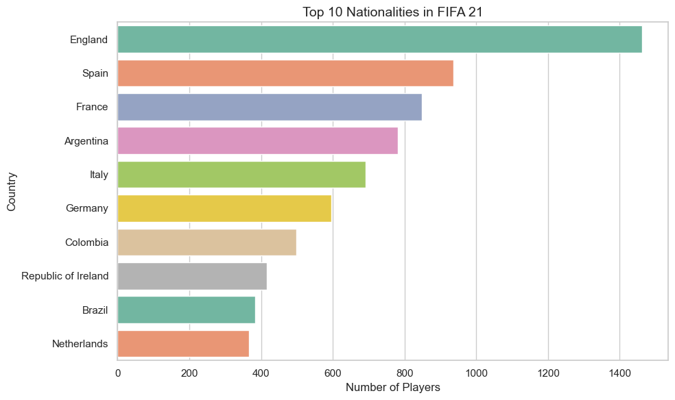
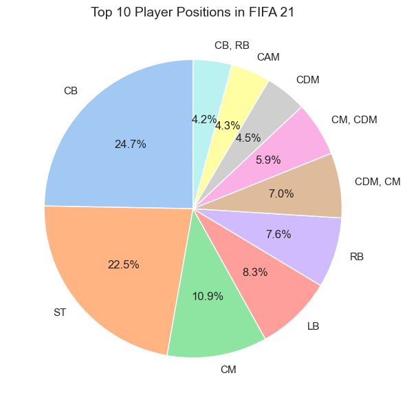
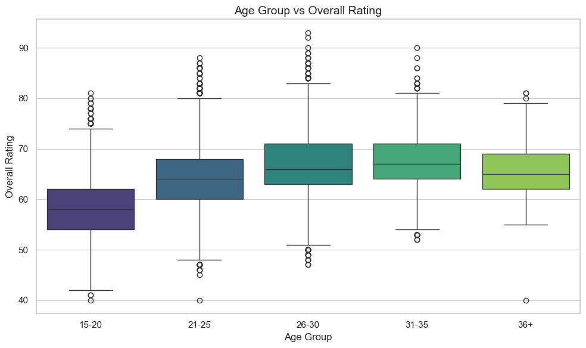
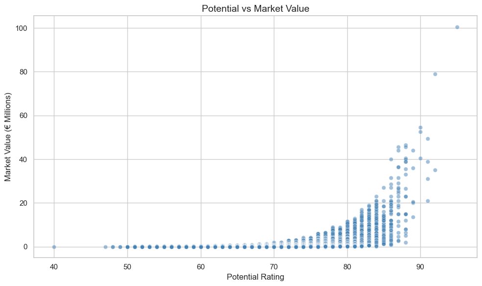
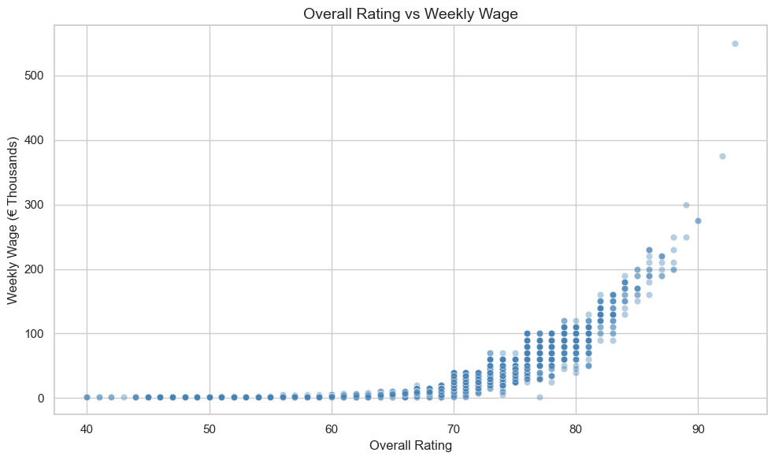
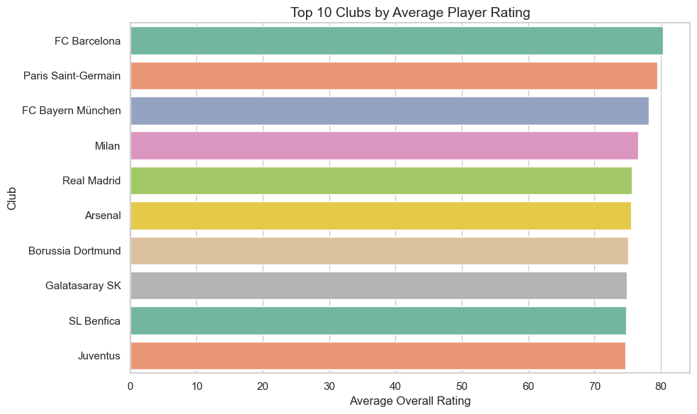
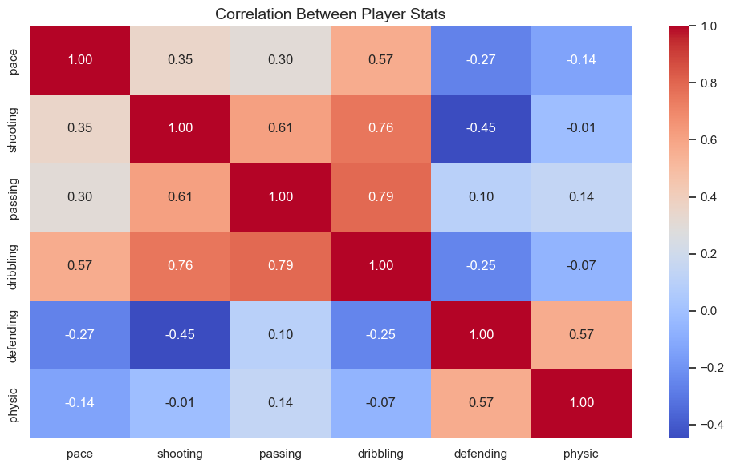

# ⚽ FIFA 21 Player Stats Analysis

   

---

## 📌 Project Overview

An exploratory data analysis project on FIFA 21 player data covering player ratings, market values, wages, nationalities, positions, and club performance. The project extracts meaningful patterns from player attributes to understand what drives market value, which clubs field the strongest squads, and how performance varies across age groups.

> **Goal:** Identify key factors that influence player ratings and market value, and uncover performance patterns across positions, clubs, and nationalities.

---

## 🔍 Problem Statements

| # | Business Question |
|---|---|
| 1 | Who are the top 10 highest-rated players in FIFA 21? |
| 2 | Which players command the highest market values? |
| 3 | Which nationalities have the most players in the game? |
| 4 | How are players distributed across positions? |
| 5 | How does overall rating vary across different age groups? |
| 6 | Is there a relationship between potential and market value? |
| 7 | Do higher-rated players earn significantly higher wages? |
| 8 | Which clubs have the highest average player ratings? |
| 9 | How do core player stats correlate with each other? |

---

## 🌟 Key Features

**🧹 Data Cleaning & Feature Engineering**
- Selected 15 relevant columns from the full dataset for focused analysis
- Dropped null values and verified zero duplicates
- Converted `value_eur` to millions and `wage_eur` to thousands for readability
- Binned player ages into groups (15-20, 21-25, 26-30, 31-35, 36+) for cleaner age analysis

**🔎 Exploratory Data Analysis (EDA)**
- Player Rating Analysis: Top 10 players by overall and potential ratings
- Market Value Analysis: Top 10 most valuable players with nationality breakdown
- Geographic Analysis: Top 10 nationalities by player count
- Position Distribution: Pie chart of top 10 player positions
- Age Analysis: Box plots showing rating distribution across age groups
- Club Analysis: Top 10 clubs ranked by average squad rating
- Wage Analysis: Scatter plot of overall rating vs weekly wage
- Correlation Analysis: Heatmap of pace, shooting, passing, dribbling, defending, physic

**📊 Visualizations (9 total)**
- Horizontal bar charts for top players, clubs, and countries
- Pie chart for position distribution
- Box plots for age group vs overall rating
- Scatter plots for potential vs value and overall vs wage
- Correlation heatmap for player attributes

---

## 📊 Visualizations

### 1. Top 10 Players by Overall Rating

### 2. Top 10 Most Valuable Players

### 3. Top 10 Nationalities

### 4. Player Position Distribution

### 5. Age Group vs Overall Rating

### 6. Potential vs Market Value

### 7. Overall Rating vs Weekly Wage

### 8. Top 10 Clubs by Average Rating

### 9. Correlation Heatmap — Player Stats

---

## 🛠️ Tech Stack

| Category | Tools |
|---|---|
| Language | Python 3.11 |
| Data Manipulation | Pandas, NumPy |
| Visualization | Seaborn, Matplotlib |
| Data Source | Kaggle — FIFA 21 Dataset |

---

## 💡 Key Insights

- **Players in the 31-35 age group** show the highest average overall ratings — peak performance years in professional football
- **Market value rises sharply with potential** — high potential players command premium valuations even before reaching peak form
- **England** contributes the most players to FIFA 21 by nationality
- **Higher overall ratings strongly correlate with higher wages** — top rated players earn disproportionately more than average
- **Dribbling and passing show strong positive correlation** — technically gifted players tend to excel in both
- **Defending and pace show weak correlation** — different positional skill sets

---

## 👤 Author

**Bhushan Gholekar**
[LinkedIn](https://linkedin.com/in/bhushan-gholekar09) • [GitHub](https://github.com/bhushang9)

