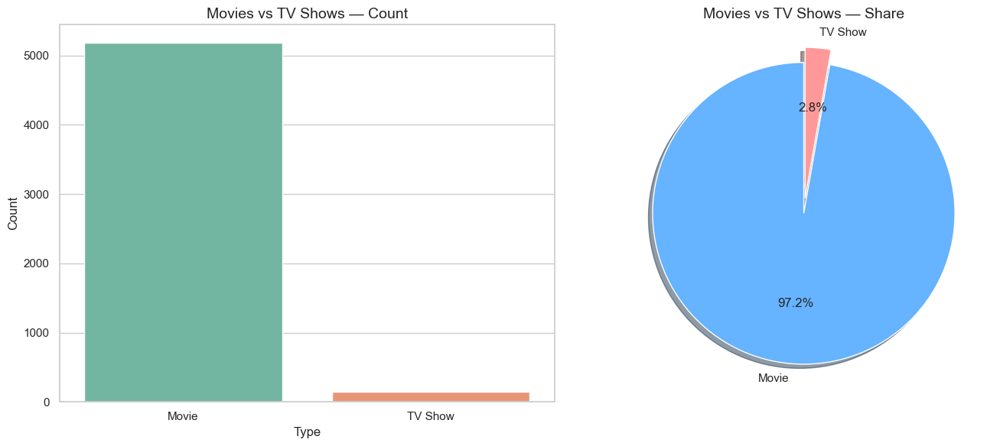
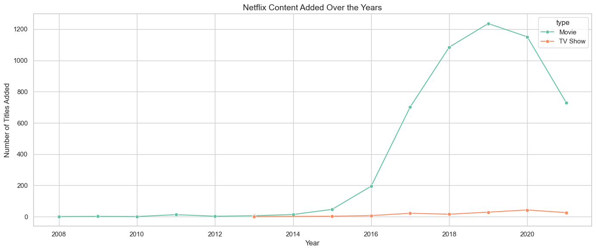
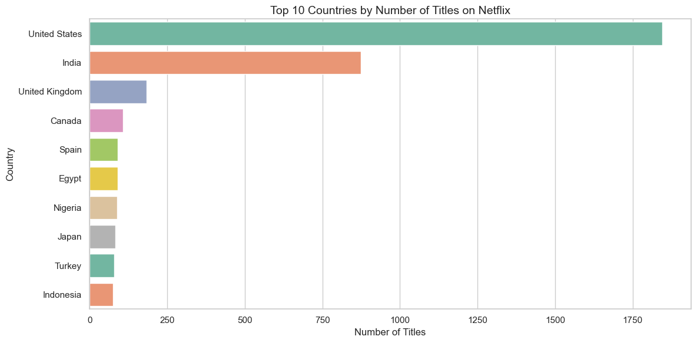
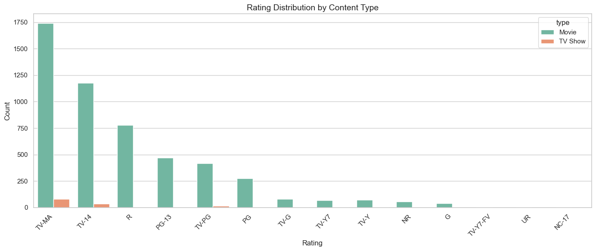
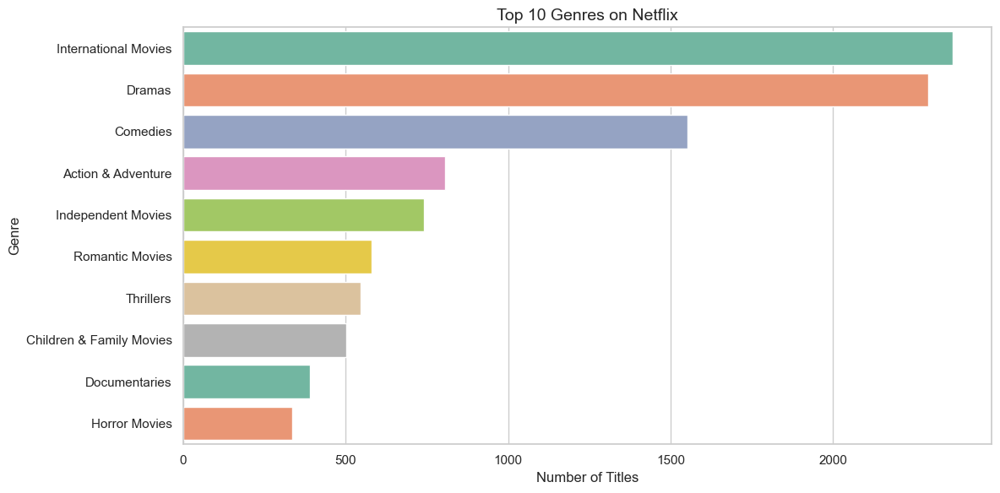
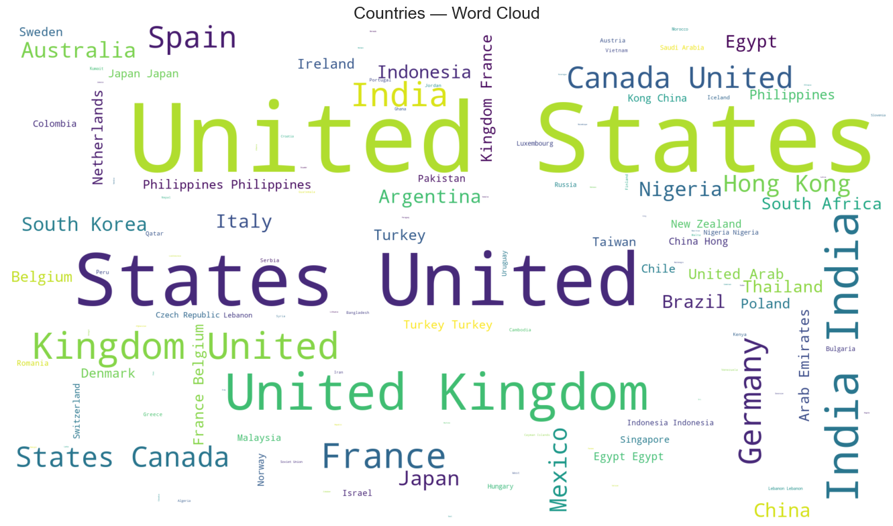
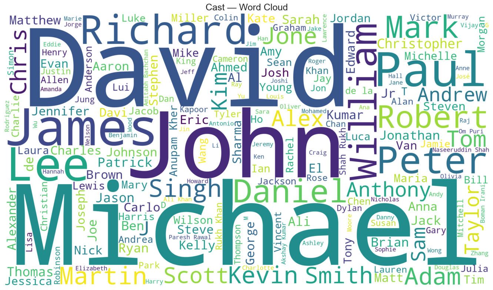
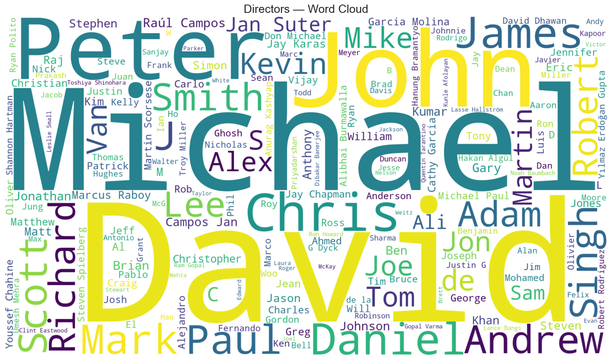
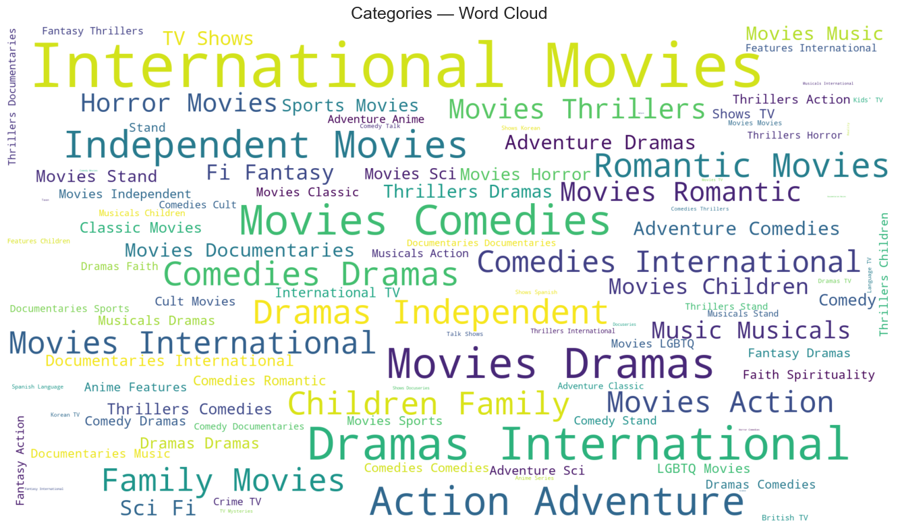

# 🎬 Netflix Content Analysis & Trend Insights

    

---

## 📌 Project Overview

This project digs into Netflix's content library of **8,807 titles** to understand how the platform has grown, what kind of content dominates, and where that content comes from. After cleaning the dataset down to **5,332 records**, the analysis covers content distribution, rating patterns, genre breakdowns, geographic trends, and year-wise growth — all backed by visualizations that tell a clear story.

> **Goal:** Turn raw Netflix data into business-relevant insights about content strategy, audience targeting, and global production trends.

---

## 🔍 Problem Statements

| # | Question |
|---|---|
| 1 | How are Movies and TV Shows distributed across the platform? |
| 2 | Which content ratings are most common, and do they differ by type? |
| 3 | When did Netflix add the most content, and has that changed over time? |
| 4 | Which countries contribute the most titles to Netflix? |
| 5 | What genres appear most frequently across the library? |
| 6 | Who are the most featured cast members and directors on the platform? |

---

## 🌟 Key Features

**🧹 Data Cleaning & Preprocessing**
- Started with 8,807 raw records — dropped nulls to get a clean working dataset of 5,332 titles
- Stripped whitespace and handled mixed date formats in the `date_added` column
- Parsed dates into separate `day`, `month`, and `year` columns for time-series analysis

**🔎 Exploratory Data Analysis (EDA)**
- Broke down content by type, rating, genre, country, and year added
- Exploded the multi-label `listed_in` column to properly count individual genres
- Grouped year-wise data separately for Movies and TV Shows to track growth trends

**📊 Visualizations (9 total)**
- Count plot + pie chart for Movies vs TV Shows split
- Grouped bar chart for rating distribution by content type
- Line chart tracking content additions year by year
- Horizontal bar charts for top 10 countries and top 10 genres
- Word clouds for countries, cast members, directors, and categories

---

## 📊 Visualizations

### 1. Movies vs TV Shows Distribution


### 2. Content Growth Over the Years


### 3. Top 10 Countries Producing Content


### 4. Rating Distribution by Content Type


### 5. Top 10 Genres


### 6. Word Clouds

| Countries | Cast |
|---|---|
|  |  |

| Directors | Categories |
|---|---|
|  |  |

---

## 🛠️ Tech Stack

| Category | Tools |
|---|---|
| Language | Python 3.x |
| Data Manipulation | Pandas, NumPy |
| Visualization | Seaborn, Matplotlib |
| Text Analysis | WordCloud |
| Data Source | Kaggle — Netflix Titles Dataset |

---

## 💡 Key Insights

- **Movies make up 70%+** of Netflix's library — TV Shows are a smaller but growing segment
- **2018–2020 was Netflix's peak content addition period** — the platform was aggressively expanding its library during those years before growth slowed post-2020
- **The United States dominates** content production by a large margin, followed by India and the UK — reflecting Netflix's heavy investment in American and South Asian content
- **TV-MA and TV-14 are the most common ratings** — Netflix's primary audience skews adult, with limited kids content by volume
- **International Movies and Dramas top the genre list** — showing Netflix's strategic push toward global, non-English content in recent years

---

## 🚀 How to Run

```bash
# Clone the repository
git clone https://github.com/bhushang9/netflix-content-insights.git

# Install dependencies
pip install pandas numpy seaborn matplotlib wordcloud

# Open the notebook
jupyter notebook netflix_insights.ipynb
```

---

## 📌 Skills Demonstrated

`Exploratory Data Analysis` `Data Cleaning` `Data Visualization` `Time-Series Analysis` `Text Analysis` `Feature Engineering` `Business Intelligence` `Python` `Pandas` `Seaborn` `Matplotlib` `WordCloud`

---

## 👤 Author

**Bhushan Gholekar**
[LinkedIn](https://linkedin.com/in/bhushan-gholekar09) • [GitHub](https://github.com/bhushang9)
